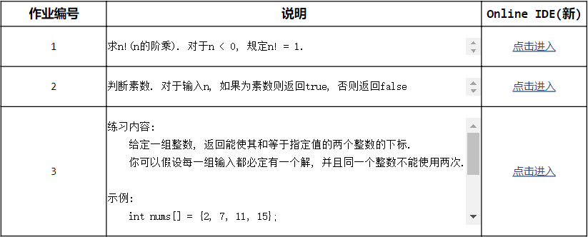

# C Programming Course Web Service

此工程用于实现C语言上机练习的自动收取, 批改, 反馈以及统计, 主要基于电子邮件技术, 使用Python 2.7开发

功能截图

使用的第三方Python软件包:

- imapclient
  - 功能: 提供IMAP客户端接口
  - 链接: <http://imapclient.readthedocs.org/>
- pyzmail
  - 功能: 提供SMTP客户端接口, 还包括email message的解析以及组装接口
  - 链接: <http://www.magiksys.net/pyzmail/>
- openpyxl
  - 功能: 提供Microsoft Excel(2003以上版本)文件读写接口
  - 链接: <http://openpyxl.readthedocs.io/en/default/>
- python-docx
  - 功能: 提供Microsoft Word(2003以上版本)文件读写接口
  - 链接: <https://python-docx.readthedocs.io/en/latest/>
- beautifulsoup4
  - 功能: 提供xml和html文件读写接口
  - 链接: <https://www.crummy.com/software/BeautifulSoup/bs4/doc.zh/>

技术问题参考: [How to get string objects instead of Unicode from JSON?](https://stackoverflow.com/questions/956867/how-to-get-string-objects-instead-of-unicode-from-json)

主要模块功能:

- **[mail.py](mail.py)** 收发邮件
- **[util.py](util.py)** 读写配置文件, 通过模板创建文件实例
- **[auto_check.py](auto_check.py)** C语言上机练习自动化主要模块

文件夹结构:

- **[config](config)** 程序配置文件
- **[include](include)** [Google Test](https://github.com/google/googletest)头文件及库文件
- **[template](template)** html模板和Word模板文件
- **[test](test)** 代码模板和单元测试文件

使用说明:

1. 在[config/student_list.xlsx](config/student_list.xlsx)中添加学生信息
1. 在[config/mail_config.json](config/mail_config.json)中添加邮箱信息

ISO C标准参考:

- [ISO C Standard](http://www.open-std.org/jtc1/sc22/wg14/)
- [ISO C11](C11.pdf)
